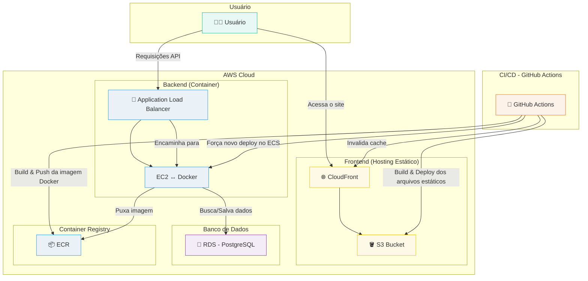

# 🏛️ Documentação da Arquitetura

Este documento descreve a arquitetura da aplicação Kanban, desde a infraestrutura na AWS até a organização do código.

## Diagrama da Arquitetura

O diagrama abaixo ilustra o fluxo de interações do usuário e os principais componentes da solução na AWS.

## Componentes

A infraestrutura é totalmente gerenciada como código usando **Terraform**, garantindo que o ambiente seja replicável e versionado.

-   **VPC (Virtual Private Cloud):** Cria uma rede isolada na AWS para hospedar todos os recursos da aplicação, garantindo segurança e controle.
-   **Frontend (S3 + CloudFront):** A aplicação Next.js é compilada para arquivos estáticos (`next build && next export`) e hospedada em um **Bucket S3 privado**. O **CloudFront (CDN)** atua na frente, distribuindo o conteúdo globalmente com baixa latência, segurança (HTTPS) e controlando o acesso ao S3 via OAC (Origin Access Control).
-   **Backend (ECS + EC2 + ALB):** A API NestJS é empacotada em uma imagem **Docker**, armazenada no **ECR (Elastic Container Registry)**. O **ECS (Elastic Container Service)** orquestra a execução do contêiner em uma instância **EC2** do tipo `t2.micro` (Nível Gratuito). O **Application Load Balancer (ALB)** recebe o tráfego da internet, distribui a carga e encaminha as requisições para o contêiner.
-   **Banco de Dados (RDS):** Um banco de dados **PostgreSQL** gerenciado pelo **RDS (Relational Database Service)**. Ele é executado em uma instância `db.t2.micro` (Nível Gratuito) dentro da VPC, acessível apenas pelo serviço do backend, garantindo a segurança dos dados.
-   **CI/CD (GitHub Actions):** Um pipeline automatizado que, a cada `push` na branch `main`:
    1.  Executa os testes.
    2.  **Backend:** Constrói a imagem Docker e a envia para o ECR. Em seguida, força uma nova implantação no serviço ECS para atualizar a aplicação.
    3.  **Frontend:** Constrói a aplicação Next.js, sincroniza os arquivos com o bucket S3 e cria uma invalidação no CloudFront para limpar o cache e servir a nova versão.